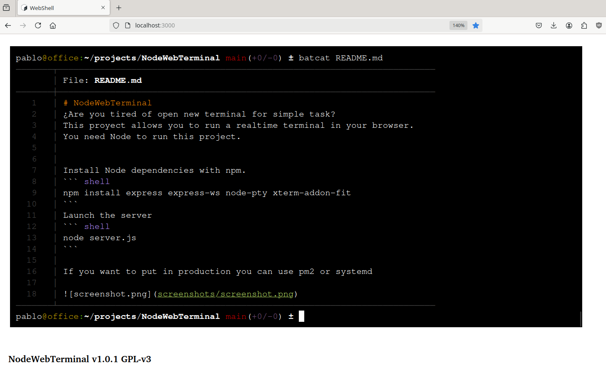

# NodeWebTerminal
¿Are you tired of open new terminal for simple task?
This proyect allows you to run a realtime terminal in your browser. 
You need Node to run this project.


Install Node dependencies with npm.
``` shell
npm install express express-ws node-pty 
```
Launch the server
``` shell
node server.js
```

If you want to put in production you can use pm2 or systemd 

